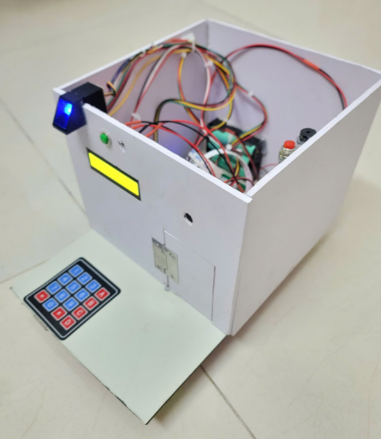
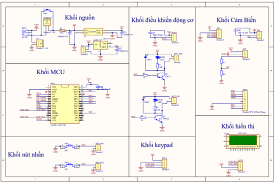

# Hệ thống Cửa Tự động Kết hợp Camera Giám sát

[](https://opensource.org/licenses/MIT)
[](https://www.arduino.cc/)
[](https://firebase.google.com/)

Dự án này là một giải pháp hoàn chỉnh cho hệ thống cửa tự động thông minh có tích hợp camera giám sát. Hệ thống cho phép người dùng điều khiển cửa từ xa thông qua ứng dụng di động, đồng thời giám sát khu vực thông qua camera ESP32-CAM.



## 📋 Mục lục
- [Tính năng](#tính-năng)
- [Cấu trúc thư mục](#cấu-trúc-thư-mục)
- [Thành phần phần cứng](#thành-phần-phần-cứng)
- [Cài đặt](#cài-đặt)
- [Phát triển](#phát-triển)
- [Đóng góp](#đóng-góp)
- [Tác giả](#tác-giả)
- [Giấy phép](#giấy-phép)

## ✨ Tính năng

### Đa dạng phương thức xác thực
- Sử dụng mật khẩu để mở cửa thông qua keypad
- Quẹt thẻ RFID để mở cửa
- Xác thực vân tay để mở cửa

### Quản lý người dùng
- Thêm/xóa thẻ RFID thông qua giao diện phím bấm
- Thêm/xóa vân tay thông qua giao diện phím bấm
- Thay đổi mật khẩu mở khóa

### An ninh & Cảnh báo
- Phát cảnh báo khi nhập sai mật khẩu, quẹt sai thẻ hoặc vân tay quá số lần quy định
- Cảnh báo qua còi báo động tại chỗ
- Thông báo cảnh báo đến ứng dụng điện thoại

### Điều khiển cửa
- Sử dụng động cơ servo mô phỏng quá trình đóng/mở cửa
- Điều khiển đóng/mở cửa từ xa thông qua ứng dụng điện thoại

### Giám sát & Thông báo
- Nút chuông tại cửa, khi có khách bấm sẽ phát âm thanh
- Thông báo về ứng dụng điện thoại khi có người bấm chuông
- Xem video trực tiếp từ camera ESP32-CAM trên ứng dụng di động
- Theo dõi trạng thái cửa (đóng/mở) trên ứng dụng

### Kết nối
- Kết nối qua WiFi
- Giao tiếp qua Firebase
- Giao diện LCD hiển thị trạng thái tại chỗ

## 📁 Cấu trúc thư mục

```
/
├── hardware/                    # Thiết kế phần cứng
│   ├── schematic/               # Sơ đồ mạch điện
│   └── pcb/                     # Thiết kế PCB
│
├── firmware/                    # Mã nguồn firmware
│   ├── esp32_main/              # Mã nguồn cho ESP32 chính
│   └── esp32cam/                # Mã nguồn cho ESP32-CAM
│
├── mobile_app/                  # Ứng dụng di động Android
│   ├── src/                     # Mã nguồn
│   └── apk/                     # File cài đặt APK
│
└── docs/                        # Tài liệu
    ├── images/                  # Hình ảnh và sơ đồ
    └── user_manual/             # Hướng dẫn sử dụng
```

## 🔧 Thành phần phần cứng

- ESP32 (điều khiển chính)
- ESP32-CAM (camera và xử lý hình ảnh)
- Màn hình LCD I2C
- Đầu đọc thẻ RFID MFRC522
- Cảm biến vân tay
- Bàn phím ma trận (keypad)
- Động cơ servo điều khiển cửa
- Còi báo động
- Nút bấm chuông
- Các cảm biến phụ trợ


## 🚀 Cài đặt

### Yêu cầu phần cứng
- Board ESP32
- Module ESP32-CAM
- Các thành phần điện tử khác theo sơ đồ mạch

### Cài đặt firmware
1. Cài đặt [Arduino IDE](https://www.arduino.cc/en/software)
2. Thêm thư viện ESP32 2.0.17 và các thư viện phụ thuộc:
   - FirebaseESP32
   - MFRC522
   - Adafruit Fingerprint Sensor
   - ESP32Servo
   - Keypad & Keypad_I2C
   - LiquidCrystal_I2C
3. Cấu hình Firebase:
   - Tạo dự án Firebase trên [Firebase Console](https://console.firebase.google.com/)
   - Trong thư mục `firmware/esp32_main/esp_esp32cam`, mở file `firebase_config.h` và cập nhật:
     ```cpp
     #define FIREBASE_HOST "your-firebase-project-id.firebaseio.com"
     #define FIREBASE_AUTH "your-firebase-secret-key"
     ```
   - Tương tự, cập nhật cấu hình trong `firmware/esp32cam/firebase_config.h`
4. Nạp firmware tương ứng cho ESP32 và ESP32-CAM

### Cài đặt ứng dụng di động
1. Thêm cấu hình Firebase cho ứng dụng Android:
   - Tải file `google-services.json` từ dự án Firebase của bạn
   - Đặt file này vào thư mục `mobile_app/src/app`
   - File mẫu `firebase-config.json.example` đã được cung cấp để tham khảo
2. Cài đặt file APK trên thiết bị Android
3. Cấu hình kết nối đến hệ thống

## 💻 Phát triển

### Môi trường phát triển
- Arduino IDE (firmware)
- Android Studio (ứng dụng di động)
- Altium Designer (thiết kế phần cứng)

### Thư viện yêu cầu
- [Firebase ESP32 Client](https://github.com/mobizt/Firebase-ESP32)
- [ESP32 Camera Driver](https://github.com/espressif/esp32-camera)
- [MFRC522](https://github.com/miguelbalboa/rfid)
- [Adafruit Fingerprint Sensor](https://github.com/adafruit/Adafruit-Fingerprint-Sensor-Library)
- [ESP32 Servo](https://github.com/madhephaestus/ESP32Servo)
- [Keypad](https://github.com/Chris--A/Keypad)
- [LiquidCrystal I2C](https://github.com/johnrickman/LiquidCrystal_I2C)

### Kiến trúc phần mềm
Phần mềm được thiết kế theo mô hình hướng đối tượng với các module độc lập:

- **Display**: Quản lý màn hình LCD
- **DoorControl**: Điều khiển cửa và servo
- **RFIDManager**: Quản lý thẻ RFID
- **FingerprintManager**: Quản lý cảm biến vân tay
- **KeypadManager**: Quản lý bàn phím và mật khẩu
- **NetworkManager**: Quản lý kết nối WiFi và Firebase
- **BuzzerManager**: Quản lý hệ thống chuông báo động
- **ButtonManager**: Quản lý các nút nhấn
- **DoorSystem**: Lớp chính điều phối tất cả các module

## 🤝 Đóng góp

Đóng góp của bạn sẽ giúp dự án trở nên tốt hơn! Dưới đây là các bước để đóng góp:

1. Fork dự án
2. Tạo nhánh tính năng mới (`git checkout -b feature/amazing-feature`)
3. Commit thay đổi của bạn (`git commit -m 'Add some amazing feature'`)
4. Push lên nhánh (`git push origin feature/amazing-feature`)
5. Mở Pull Request

## 👨‍💻 Tác giả

- **Trần Phương Nam** - [GitHub](https://github.com/tranphuongnam2912) - tranphuongnam292003@gmail.com

## 📄 Giấy phép

Dự án này được phân phối dưới giấy phép MIT. Xem file [`LICENSE`](LICENSE) để biết thêm chi tiết. 